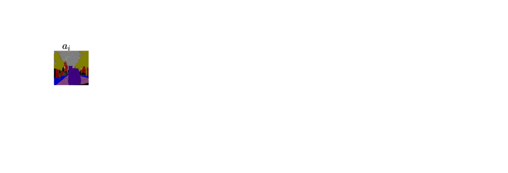

# UncertaintyAwareCycleConsistency
This repository provides the building blocks and the API for the work presented in the **NeurIPS'21** paper
[Robustness via Uncertainty-aware Cycle Consistency](https://arxiv.org/pdf/2110.12467.pdf).
Translation methods often learn deterministic mappings without explicitly modelling the robustness to outliers or predictive uncertainty, leading to performance degradation when encountering unseen perturbations at test time. To address this, we propose a method based on Uncertainty-aware Generalized Adaptive Cycle Consistency (UGAC), which models the per-pixel residual by generalized Gaussian distribution, capable of modelling heavy-tailed distributions.



### Requirements
```
python >= 3.6.10
pytorch >= 1.6.0
jupyter lab
torchio
scikit-image
scikit-learn
```

The structure of the repository is as follows:
```
root
 |-ckpt/ (will save all the checkpoints)
 |-data/ (save your data and related script)
 |-src/ (contains all the source code)
    |-ds.py 
    |-networks.py
    |-utils.py
    |-losses.py
```

### Preparing Datasets
To prepare your datasets to use with this repo, place the root directory of the dataset in `data/`.
The recommended way to structure your data is shown below.
```
data/
    |-Dataset_1/
        |-A/
            |-image1.png
            |-image2.png
            |-image3.png
            |-...
        |-B/
            |-image1.png
            |-image2.png
            |-image3.png
            |-...
```
Note the images need not be paired. The python script `src/ds.py` provides the PyTorch `Dataset` class to read such a dataset, used as explained below.
```python
class Images_w_nameList(data.Dataset):
    '''
    can act as supervised or un-supervised based on flists
    '''
    def __init__(self, root1, root2, flist1, flist2, transform=None):
```
Here `root1` and `root2` represents the root directory for domain A and B, respectively.
`flist1` and `flist2` contain image names for domain A and domain B. Note, if `flist1` and `flist2` are aligned then dataset will load paired images. To use it as unsupervised dataset loader ensure that `flist1` and `flist2` are not aligned.


### Learning models with uncertainty
`src/networks.py` provides the generator and discriminator architectures.

`src/utils.py` provides the training API `train_UGAC`. The API is to train a pair of GANs, with the generators modified to predict the parameters of the generalized Gaussian distribution GGD ($\alpha$, $\beta$, $\mu$), as depicted in the above figure.

An example command to use the first API is:
```python
#first instantiate the generators and discriminators
netG_A = CasUNet_3head(3,3)
netD_A = NLayerDiscriminator(3, n_layers=4)
netG_B = CasUNet_3head(3,3)
netD_B = NLayerDiscriminator(3, n_layers=4)

netG_A, netD_A, netG_B, netD_B = train_UGAC(
    netG_A, netG_B,
    netD_A, netD_B,
    train_loader,
    dtype=torch.cuda.FloatTensor,
    device='cuda',
    num_epochs=10,
    init_lr=1e-5,
    ckpt_path='../ckpt/ugac',
    list_of_hp = [1, 0.015, 0.01, 0.001, 1, 0.015, 0.01, 0.001, 0.05, 0.05, 0.01],
)
```
This will save checkpoints in `ckpt/` named as `ugac_eph*.pth`. The arguement `list_of_hp` is a list of all the hyper-parameters representing weights of different weigths in the loss function.

Apart from the code in this repository, we also use the code from many other repositories like [this](https://github.com/junyanz/pytorch-CycleGAN-and-pix2pix), [this](https://github.com/taey16/pix2pixBEGAN.pytorch), and [this](https://github.com/aitorzip/PyTorch-CycleGAN).

### Bibtex
If you find the bits from this project helpful, please cite the following works:

```
@article{upadhyay2021robustness,
  title={Robustness via Uncertainty-aware Cycle Consistency},
  author={Upadhyay, Uddeshya and Chen, Yanbei and Akata, Zeynep},
  booktitle={NeurIPS},
  year={2021}
}
```